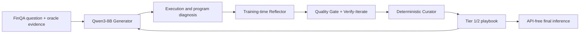

# ACE-FinQA

[](https://github.com/ThanhDatVN/Agentic-Context-Engineering-for-Financial-Question-Answering-with-Small-Language-Models/actions/workflows/ci.yml)
[](https://www.python.org/)
[](https://github.com/czyssrs/FinQA)
[](LICENSE)

ACE-FinQA is the research codebase for **Evaluating Agentic Context Engineering for Small Language Models on Financial Reasoning Tasks (FinQA)**, an undergraduate thesis by Lê Thành Đạt at the University of Engineering and Technology, Vietnam National University, Hanoi.

The project investigates whether a small language model can improve financial program synthesis by evolving a compact, human-readable reasoning playbook instead of updating model weights. Qwen3-8B acts as the Generator, an OpenAI model acts as the training-time Reflector, and deterministic Python logic acts as the Curator. Final inference uses Qwen3-8B and the learned playbook without an API call. The cleaned rerun notebook defaults to GPT-4o mini; retained metadata from the historical run records GPT-4o.

## Audited results

The repository distinguishes historical notebook metrics from metrics recomputed with the current strict CPU evaluator. Comparisons are valid only within one metric profile.

| Metric profile | Method | EA count | EA | PA count | PA |
|---|---|---:|---:|---:|---:|
| Historical notebook | Qwen3-8B FS-9 | 683/1,147 | 59.55% | 604/1,147 | 52.66% |
| Historical notebook | **ACE-FinQA** | 773/1,147 | **67.39%** | 710/1,147 | **61.90%** |
| Current `strict-v1` | Qwen3-8B FS-9 | 724/1,147 | 63.12% | 642/1,147 | 55.97% |
| Current `strict-v1` | **ACE-FinQA** | 777/1,147 | **67.74%** | 687/1,147 | **59.90%** |

Under the historical notebook profile, ACE-FinQA improves over the same-profile Qwen3-8B baseline by **7.85 EA points** and **9.24 PA points**, calculated from raw counts. Under `strict-v1`, the gains are **4.62 EA points** and **3.92 PA points**. `strict-v1` is a repository regression profile, not a claim of exact equivalence with the official FinQA evaluator.

The thesis reports **68.06% EA / 61.90% PA** as a test result, but the retained test artifact supports **67.39% / 61.90%** under its historical metric profile. The thesis EA appears to mix an 883-example outcome result with the 1,147-example test result; its configuration narrative also differs from retained run metadata. See the [result audit and errata](results/audit.md) before citing a score.

The [results report](results/report.md) separates audited results from thesis transcriptions. Counts, source commit/blob hashes, metric profiles, and known discrepancies are machine-readable in [the result manifest](results/manifest.json).

## Method



ACE-FinQA extends the Generator–Reflector–Curator loop with:

- reasoning-aware outcomes that consider both answer execution and program structure;
- static and behavioral validation for proposed playbook guidance;
- cluster-aware retrieval and causal-lift tracking for reusable guidance;
- checkpoint selection and pruning guarded by both EA and PA.

The evaluation uses annotated FinQA evidence (`gold_inds`). Results therefore measure **oracle-context reasoning**, not end-to-end retrieval. See [Methodology](docs/methodology.md) for the complete design.

## Repository structure

```text
.
├── data/finqa/           # FinQA train/dev/test snapshots
├── docs/                 # Method, results, reproducibility, and thesis
├── notebooks/            # Clean, sectioned Colab experiment notebooks
├── results/              # Audited results, thesis transcriptions, and figures
├── scripts/              # Validation and notebook maintenance tools
├── src/ace_finqa/        # Tested CPU-safe package and CLI
├── tests/                # Unit and repository consistency tests
└── .github/workflows/    # Continuous integration
```

## Quick start

For the author and authorized collaborators, the CPU package validates data, executes the FinQA DSL, evaluates prediction files, and checks repository artifacts. It does not download a model or call an external API. Review [`LICENSE`](LICENSE) before using original project materials.

```bash
python -m venv .venv
# Linux/macOS: source .venv/bin/activate
# Windows PowerShell: .venv\Scripts\Activate.ps1
python -m pip install -e ".[dev]"

ace-finqa data-summary --data-dir data/finqa
ace-finqa verify-repo --data-dir data/finqa --results-dir results
python scripts/check_consistency.py
python scripts/audit_historical_results.py  # requires full Git history
python scripts/generate_result_figures.py --check
python -m unittest discover -s tests -v
```

Evaluate a JSON or JSONL prediction file with the repository's fail-closed evaluator:

```bash
ace-finqa evaluate \
  --data-file data/finqa/test.json \
  --predictions path/to/predictions.json
```

Run `ace-finqa --help` for supported schemas and options.

## Experiment notebooks

The notebooks are output-free, divided into focused Markdown and code cells, and designed for a fresh Google Colab runtime:

1. [`01_qwen3_baseline.ipynb`](notebooks/01_qwen3_baseline.ipynb) — Qwen3-8B baseline inference.
2. [`02_ace_finqa.ipynb`](notebooks/02_ace_finqa.ipynb) — ACE playbook construction and evaluation.

GPU experiments require Linux/CUDA, Google Drive, model downloads, the packages in [`requirements/experiment.txt`](requirements/experiment.txt), and an `OPENAI_API_KEY` for ACE training. Final inference is API-free. Read [Reproducibility](docs/reproducibility.md) before running either notebook and write new outputs outside `results/`.

## Documentation

- [Methodology](docs/methodology.md) — architecture and research mechanisms.
- [Results](docs/results.md) — audited metrics, thesis errata, and evaluation scope.
- [Reproducibility](docs/reproducibility.md) — CPU checks and GPU rerun procedure.
- [Data](data/README.md) — FinQA provenance, splits, and terms.
- [Research card](docs/research-card.md) — intended use, risks, and limitations.
- [Contributing](CONTRIBUTING.md) and [Security](SECURITY.md) — project policies.

## Scope and limitations

- Results use oracle evidence and do not measure document retrieval.
- Historical notebook metrics and `strict-v1` metrics use different evaluators and must not be mixed.
- The thesis contains result/configuration discrepancies documented in `results/audit.md`.
- The study covers one small-model family and one financial QA benchmark.
- The main experiment is effectively single-seed; API-assisted training is not deterministic.
- The 4-step and 5+-step subsets are small and do not support strong subgroup conclusions.
- This is a research prototype, not financial advice or a production decision system.

## Citation and license

Use [`CITATION.cff`](CITATION.cff) when citing this repository. The thesis is available at [`docs/thesis.pdf`](docs/thesis.pdf).

FinQA data originates from the [official FinQA repository](https://github.com/czyssrs/FinQA) and remains under its upstream MIT terms; see [`data/README.md`](data/README.md) and [`THIRD_PARTY_NOTICES.md`](THIRD_PARTY_NOTICES.md).

Original ACE-FinQA code and thesis materials are **All Rights Reserved** unless the copyright holder grants separate permission. Third-party materials remain under their respective licenses.
