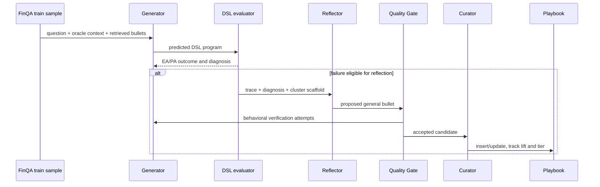

# Methodology

## Research question

ACE-FinQA asks whether Agentic Context Engineering can improve a small language model on multi-step financial program synthesis without fine-tuning model weights. Each FinQA answer is represented as a flat executable program over arithmetic and table aggregation operations.

The thesis experiment is a controlled reasoning study: prompts use supporting facts from the dataset's annotated `qa.gold_inds`. Retrieval quality is therefore held outside the measured pipeline. Results must be labeled **oracle-context**, not end-to-end financial QA.

## System roles

### Generator

Qwen3-8B receives the question, oracle context, system rules, nine few-shot examples, and selected playbook bullets. It emits a flat FinQA DSL program. Final evaluation uses deterministic, single-shot generation at temperature 0 with seed 42.

### Reflector

When a training example fails, the Reflector analyzes the question, predicted program, execution result, gold program, diagnosis, and relevant playbook context. It proposes a general strategy bullet rather than a sample-specific solution.

The thesis narrative describes GPT-4o mini at temperature 0 with JSON response mode as the training-time Reflector, and the cleaned rerun notebook uses that default. The retained historical run metadata instead records `gpt-4o`. Final inference does not use the API.

### Curator

The Curator is rule-based Python. It validates, inserts, tracks, promotes, demotes, and prunes bullets. Its purpose is to keep the playbook auditable and to prevent unconstrained LLM-written memory from directly controlling later generations.

## Training loop

## Research mechanisms

### Reasoning-aware outcomes

The notebook distinguishes correct, lucky-guess, execution-mismatch, wrong-reasoning, and no-program outcomes. Checkpoint selection combines EA and PA using a reported `0.6 × EA + 0.4 × PA` score and a PA guard intended to prevent EA gains caused by structurally wrong programs.

### Defense in depth

The cleaned rerun notebook sends candidate bullets through six static Quality Gate layers and at most three Verify-Iterate rounds, requiring both EA and PA. The historical metadata records at most five rounds and `verify_require_pa=false`. The notebook contains layered checks for syntax, FinQA conventions, specificity, duplicate content, and observed Generator behavior, but the cleaned defaults must not be presented as the exact historical run configuration.

### Cluster-aware memory

Questions are assigned to hand-designed structural clusters. Retrieval separates stable Tier 1 bullets from dynamic Tier 2 bullets and combines semantic, lexical, value, and usage signals. Dev-set leave-one-out measurements estimate a bullet's contribution; an exponential moving average is stored as a causal-lift proxy.

### Selection and pruning

The experiment tracks multiple best snapshots (composite, EA-constrained, and PA). It also contains automatic ablation and post-training pruning logic. The thesis selects a three-bullet playbook and reports seven ablations; their aggregate values are preserved in `results/tables/`.

## Evaluation semantics

Audited metrics, thesis transcriptions, and their distinct profiles are stored in `results/manifest.json` and `results/tables/`. Both cleaned notebooks now use fail-closed FinQA execution, exact table-row lookup, percent-literal conversion, and answer comparison after rounding to five decimal places. These changes improve future reruns but are not retroactive proof of the historical notebook metrics.

The CPU package provides the `strict-v1` fail-closed evaluator for development and regression testing. It converts percent literals to decimals, resolves FinQA table row labels, rejects invalid references, and returns structured errors for malformed programs. Its output must be labeled `strict-v1`; it must not be mixed with historical notebook values or represented as an official FinQA leaderboard result.

## What is reusable

The package extracts the stable, CPU-safe parts of the work: dataset validation, context construction, DSL parsing/execution, prediction evaluation, result classification, and repository checks. The ACE training state machine remains in the notebook, but it is now divided into named, bounded sections. Moving that GPU/API state machine into `src/` remains future work because doing so safely requires explicit state objects and integration tests.
