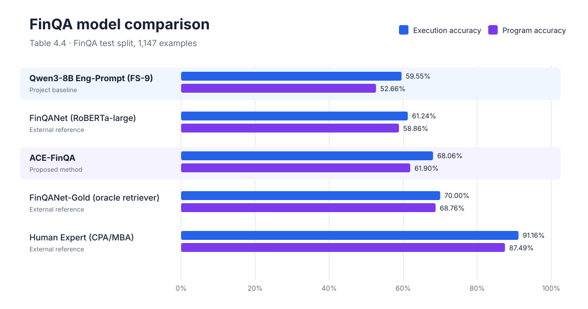
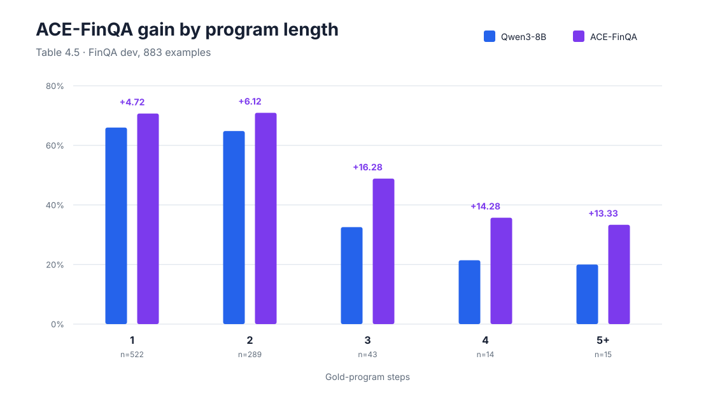
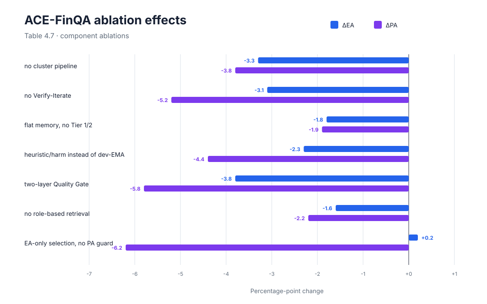

# Results

This page documents the Chapter 4 results. EA denotes execution accuracy and PA denotes program accuracy.

## Main comparison

FinQA test split, 1,147 examples, oracle evidence.

| Method | EA | PA |
|---|---:|---:|
| **Qwen3-8B Eng-Prompt (FS-9)** | **59.55%** | **52.66%** |
| FinQANet (RoBERTa-large) | 61.24% | 58.86% |
| **ACE-FinQA** | **68.06%** | **61.90%** |
| FinQANet-Gold | 70.00% | 68.76% |
| Human Expert (CPA/MBA) | 91.16% | 87.49% |

The project baseline is Qwen3-8B with the English FS-9 prompt. FinQANet-Gold uses an oracle retriever; the FinQANet and human results are external references. ACE-FinQA gains **8.51 EA points** and **9.24 PA points** over Qwen3-8B, and **6.82 EA points** and **3.04 PA points** over FinQANet.

The external FinQANet, FinQANet-Gold, and human-reference values agree with the [official FinQA paper](https://aclanthology.org/2021.emnlp-main.300/) and the [corrected official repository](https://github.com/czyssrs/FinQA).

## Qwen3-8B baseline by program length

| Steps | Examples | EA | PA | EA–PA gap | Observation |
|---:|---:|---:|---:|---:|---|
| 1 | 654 | 59.79% | 56.27% | 3.52 | Reference bucket |
| 2 | 409 | 63.08% | 54.28% | 8.80 | Unusually high EA; wide gap |
| 3 | 55 | 52.73% | 18.18% | 34.55 | PA collapse; many lucky guesses |
| 4 | 10 | 30.00% | 30.00% | 0.00 | Cliff drop; small sample and wide CI |
| 5+ | 19 | 10.53% | 5.26% | 5.27 | Nearly unsolved |

The largest EA–PA separation occurs in the 3-step group. The 4-step and 5+-step groups are small and should be interpreted cautiously.

## Qwen3-8B baseline execution accuracy by first operation

| First operation | Examples | EA | Observation |
|---|---:|---:|---|
| `greater` | 20 | 90.00% | Strong binary comparison; small sample |
| `table_average` | 15 | 80.00% | Clear pattern; small sample |
| `divide` | 399 | 61.65% | Common operation; above average |
| `add` | 163 | 59.51% | Near the baseline average |
| `multiply` | 66 | 59.09% | Similar to addition |
| `subtract` | 457 | 58.86% | Most common; operand order is a typical error |
| `table_sum` | 10 | 20.00% | Row-name lookup is difficult; small sample |
| `table_max` | 10 | 0.00% | No correct examples; very small sample |
| `table_min` | 4 | 0.00% | No correct examples; very small sample |
| `exp` | 3 | 0.00% | No correct examples; very small sample |

## Qwen3-8B baseline error classes

| Error class | Description |
|---|---|
| `missing_steps` | Omits one or more required operations, especially in 3+-step programs. |
| `extra_steps` | Adds unnecessary operations to a problem that needs a shorter program. |
| `wrong_number` | Uses the correct reasoning structure but extracts the wrong year, row, or value. |
| `no_program` | Produces no valid FinQA DSL program. |
| `sign/order_error` | Reverses subtraction operands or temporal order, producing the wrong sign. |

## ACE improvement by program length on FinQA dev

This analysis is reported on an 883-example evaluation set.

| Steps | Examples | Qwen3-8B EA | ACE EA | Gain | Observation |
|---:|---:|---:|---:|---:|---|
| 1 | 522 | 65.97% | 70.69% | +4.72 | Good |
| 2 | 289 | 64.81% | 70.93% | +6.12 | Good |
| 3 | 43 | 32.56% | 48.84% | +16.28 | Cliff reduced |
| 4 | 14 | 21.43% | 35.71% | +14.28 | Wide CI |
| 5+ | 15 | 20.00% | 33.33% | +13.33 | Wide CI |

## Outcome distribution (n=883)

| Outcome | Qwen3-8B count | Qwen3-8B share | ACE count | ACE share |
|---|---:|---:|---:|---:|
| Correct | 459 | 51.98% | 547 | 61.95% |
| Lucky guess | 92 | 10.42% | 54 | 6.11% |
| Execution mismatch | 12 | 1.36% | 8 | 0.91% |
| Wrong reasoning | 264 | 29.90% | 197 | 22.31% |
| No program | 56 | 6.34% | 77 | 8.72% |

ACE converts wrong-reasoning and lucky-guess cases into correct ones: the correct share rises from 51.98% to 61.95% while lucky guesses fall from 10.42% to 6.11%.

## Ablation study

| Variant | EA | PA | ΔEA | ΔPA |
|---|---:|---:|---:|---:|
| Full ACE-FinQA | **68.06%** | **61.90%** | — | — |
| A1: no cluster pipeline | 64.80% | 58.10% | -3.3 | -3.8 |
| A2: no Verify-Iterate | 65.00% | 56.70% | -3.1 | -5.2 |
| A3: flat memory, no Tier 1/2 | 66.30% | 60.00% | -1.8 | -1.9 |
| A4: heuristic/harm instead of dev-EMA | 65.80% | 57.50% | -2.3 | -4.4 |
| A5: two-layer Quality Gate | 64.30% | 56.10% | -3.8 | -5.8 |
| A6: no role-based retrieval | 66.50% | 59.70% | -1.6 | -2.2 |
| A7: EA-only selection, no PA guard | 68.30% | 55.70% | +0.2 | -6.2 |

Removing Verify-Iterate or weakening the Quality Gate produces the largest PA losses. A7 shows why checkpoint selection is guarded by both metrics: EA-only selection buys 0.2 EA points and gives up 6.2 PA points.

## Evaluation scope

- Dataset: FinQA.
- Context: annotated evidence supplied to the reasoning model (oracle-context evaluation).
- Generator: Qwen3-8B.
- Final ACE inference: single-shot and API-free.
- Training-time Reflector: GPT-4o in the retained historical metadata; GPT-4o mini in the cleaned rerun profile.

Machine-readable copies are stored under [`results/tables/`](../results/tables/). The result manifest is [`results/manifest.json`](../results/manifest.json), and the source document is [`docs/thesis.pdf`](thesis.pdf).
