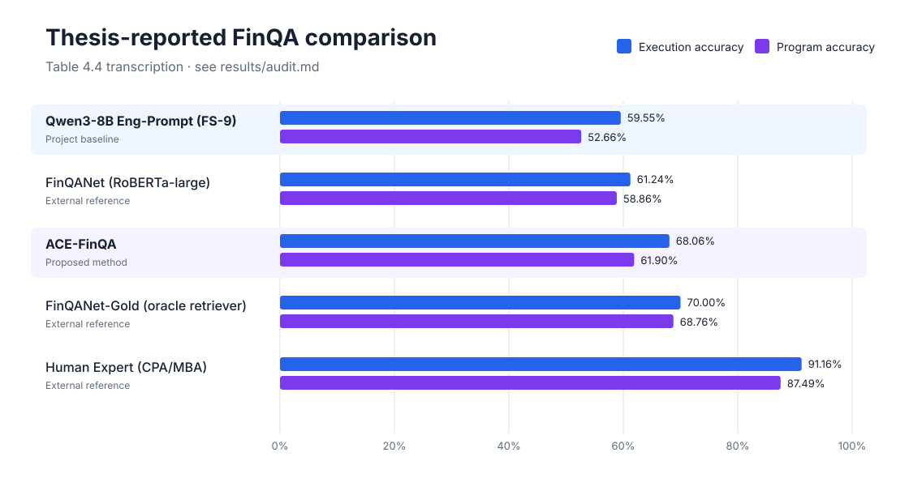
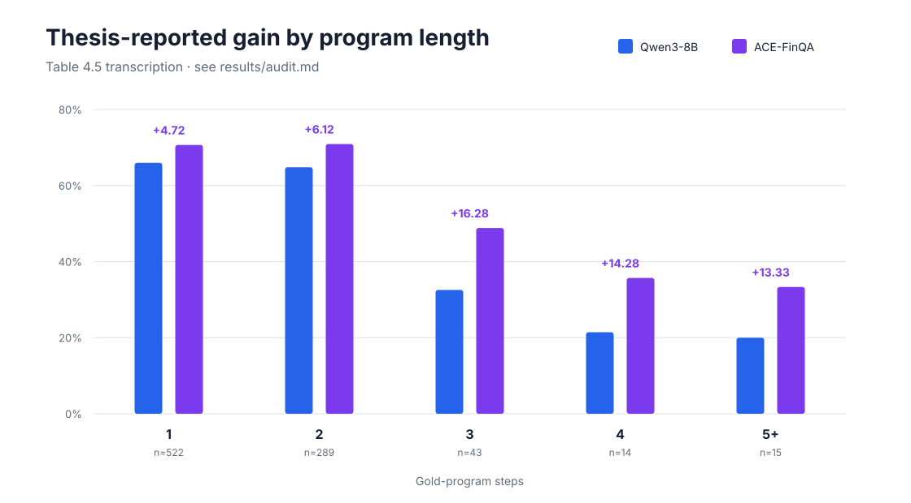
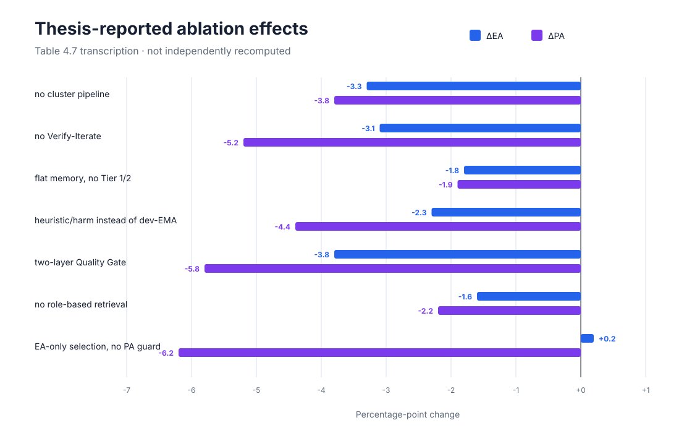

# ACE-FinQA results

**Task:** FinQA program synthesis with annotated evidence.
**Audited historical test result:** **67.39% EA / 61.90% PA** under the legacy notebook metric profile.

## Audited test comparison

| Metric profile | Method | EA count | EA | PA count | PA |
|---|---|---:|---:|---:|---:|
| Historical notebook | Qwen3-8B FS-9 | 683/1,147 | 59.55% | 604/1,147 | 52.66% |
| Historical notebook | **ACE-FinQA** | 773/1,147 | **67.39%** | 710/1,147 | **61.90%** |
| Current `strict-v1` | Qwen3-8B FS-9 | 724/1,147 | 63.12% | 642/1,147 | 55.97% |
| Current `strict-v1` | **ACE-FinQA** | 777/1,147 | **67.74%** | 687/1,147 | **59.90%** |

The historical-profile gains from raw counts are **+7.85 EA points** and **+9.24 PA points**. The `strict-v1` gains are **+4.62 EA points** and **+3.92 PA points**. Do not compare a historical-profile score with a `strict-v1` score.

See [`audit.md`](audit.md) for source hashes, arithmetic, configuration discrepancies, and the thesis errata.

## Thesis-reported comparison

The following table is a faithful transcription of Thesis Table 4.4, not the audited primary result.

| Method | EA | PA |
|---|---:|---:|
| Qwen3-8B (FS-9 baseline) | 59.55% | 52.66% |
| FinQANet (RoBERTa-large) | 61.24% | 58.86% |
| ACE-FinQA | 68.06% | 61.90% |
| FinQANet-Gold | 70.00% | 68.76% |
| Human Expert (CPA/MBA) | 91.16% | 87.49% |

The retained test artifact does not support the thesis's 68.06% ACE EA value. It supports 773/1,147 = 67.39%; 68.06% comes from the EA quadrant counts in the thesis's 883-example outcome table.

## Thesis-reported FinQA dev complexity analysis

| Gold-program steps | Examples | Qwen3-8B EA | ACE EA | Gain |
|---:|---:|---:|---:|---:|
| 1 | 522 | 65.97% | 70.69% | +4.72 |
| 2 | 289 | 64.81% | 70.93% | +6.12 |
| 3 | 43 | 32.56% | 48.84% | +16.28 |
| 4 | 14 | 21.43% | 35.71% | +14.28 |
| 5+ | 15 | 20.00% | 33.33% | +13.33 |

The displayed rows weight to 62.48% baseline EA and 68.52% ACE EA. They do not aggregate to Thesis Table 4.4, so they are retained as a transcription rather than used to recompute the headline result.

## Thesis-reported ablation study

| Variant | EA | PA | ΔEA | ΔPA |
|---|---:|---:|---:|---:|
| Full ACE-FinQA | **68.06%** | **61.90%** | — | — |
| No cluster pipeline | 64.80% | 58.10% | -3.3 | -3.8 |
| No Verify-Iterate | 65.00% | 56.70% | -3.1 | -5.2 |
| Flat memory, no Tier 1/2 | 66.30% | 60.00% | -1.8 | -1.9 |
| Heuristic/harm instead of dev-EMA | 65.80% | 57.50% | -2.3 | -4.4 |
| Two-layer Quality Gate | 64.30% | 56.10% | -3.8 | -5.8 |
| No role-based retrieval | 66.50% | 59.70% | -1.6 | -2.2 |
| EA-only selection, no PA guard | 68.30% | 55.70% | +0.2 | -6.2 |

The ablation values have no retained per-example artifacts in the cleaned record and should be treated as thesis-reported only. The full table set is documented in [`docs/results.md`](../docs/results.md), while machine-readable audited results and provenance are in [`manifest.json`](manifest.json).
